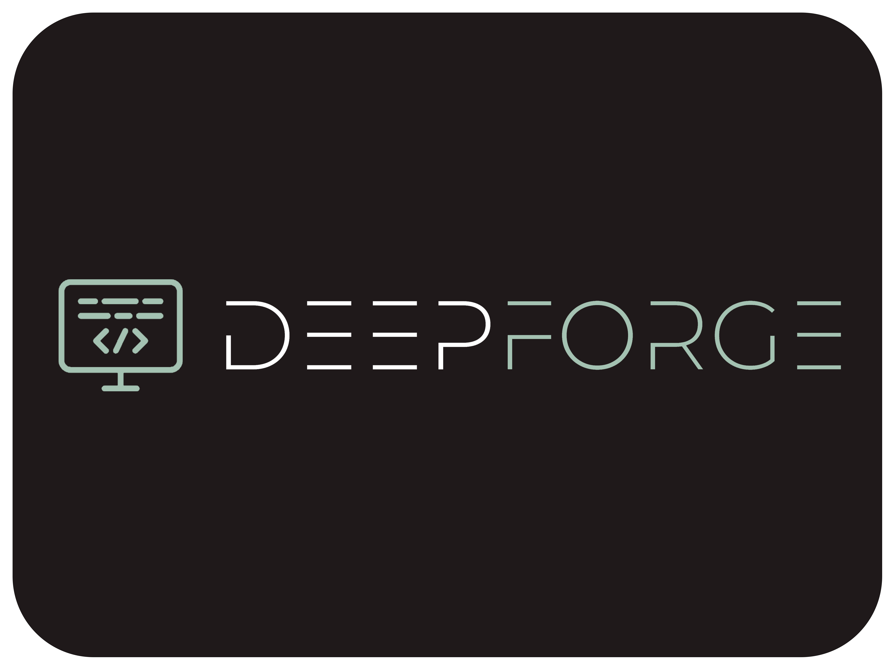

  

<h3 align="center">DeepForge Toolset - cross-platform installer of necessary tools for programming.
</h3>

  

<!-- ## 🚀 Installation

  

Windows

<a href="https://github.com/DeepForge-Technology/DeepForge-Toolset/releases/tag/v0.1_win_amd64">Download for amd64</a>

Linux

<a href="https://github.com/DeepForge-Technology/DeepForge-Toolset/releases/tag/v0.1_linux_amd64">Download for amd64</a>

MacOS

<a href="https://github.com/DeepForge-Technology/DeepForge-Toolset/releases/tag/v0.1_macos_amd64">Download for amd64(Intel)</a>

 -->

## 👥 Authors
1. @Blackflame576
2. @DeepForge-Technology

## 🤖 Support
<!-- [Email](mailto:deepforge.technology@gmail.com) -->

    
    

## 💳 Donating

    

  

##  ℹ️ License
[MIT LICENSE](LICENSE)
